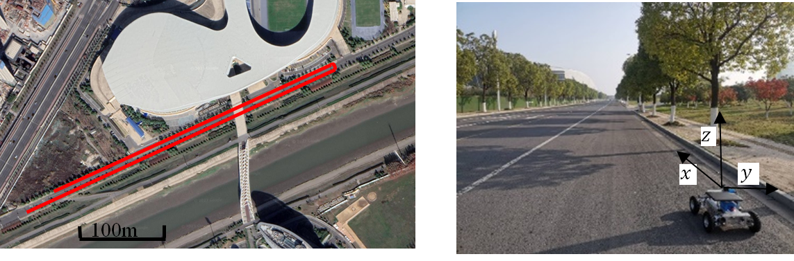
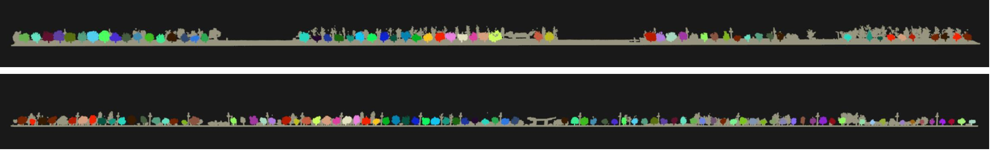

### **Urban Street Tree Point Cloud Dataset (USTPCD)**  
[](https://creativecommons.org/licenses/by/4.0/)  

USTPCD是一个通过移动激光扫描（Mobile Laser Scanning, MLS）技术采集的高精度街道树木点云数据集，旨在支持基于深度学习的城市环境实例分割任务。

---

#### **📖 数据集概述**  
- **目的**：推动实时的行道树 单株树木分割、城市林业管理以及基于LiDAR的3D感知研究。  
- **来源**：使用车载MLS系统在中国南京的城市街道上采集。  
- **内容**：  
  - 如图 City roda 第一张所示的是数据集采集地鸟瞰图，采集地为南京市奥体中心附件的街道场景。第二张为点云采集设备工作场景，使用阿克曼小车搭载激光雷达匀速采集行道树点云。

  - 如图 Point Cloud 图中灰色部分为非行道树点，每棵行道树点云都赋值了唯一的实例标签。可视化结果供您参考。

  - 149棵高度（3.58m–7.20m）和冠幅（2.94m–8.46m）各异的街道树木。  
  - 包含建筑物、车辆、行人、交通标志和其他植被的复杂城市场景。  
  - 街道树木的像素级和点级实例分割标注掩码。  
- **格式**：  
  - 原始LiDAR点云帧（由于博主使用python读取数据，所以原始数据为`.npy`格式，如图所示1-6列数据分别表示x，y，z，）。  
 
如需下载数据集，请访问我们的百度网盘链接：  
[点击此处从百度网盘下载 USTPCD 数据集](通过网盘分享的文件：Tree
链接: https://pan.baidu.com/s/16u30GiOMZZUjU90wjTcIvw?pwd=rsxt 提取码: rsxt)  


---

#### **📡 数据采集**  
##### **硬件配置**  
| 设备              | 型号           | 参数                                  |
|---------------------|-----------------|---------------------------------------|
| LiDAR传感器        | UTM-30LX-EW     | 270°视场角，0.25°分辨率，25ms/帧      |
| 移动平台          | R550 PLUS Robot | 速度：0.4 m/s                        |
| 数据采集电脑       | -               | AMD Ryzen 7处理器，NVIDIA RTX 3060显卡，16GB内存 |

##### **关键参数**  
- **LiDAR帧率**：40 Hz（每帧25 ms）  
- **扫描范围**：0.1–60 m（精度：±30–50 mm）  
- **回波模式**：记录前3次回波  
- **坐标系**：世界坐标系（`x`为移动方向，`y`为前向深度，`z`为高度）

---

#### **🗂 数据集结构**  
（数据集共包括2侧街道，东侧和西侧的.npy格式点云文件：east.npy/west.npy）

---

#### **🔍 数据属性**  
每个点云帧包含：  
- **3D坐标**：`(x, y, z)`（米，世界坐标系）  
- **实例标签值**：0-n，0是非行道树点云标签，n为从1开始的行道树标签。


---


---

#### **📜 引用方式**  
若使用该数据集，请引用原始论文：  
```bibtex
@article{li2024online,
  title={Online segmentation of street trees from mobile laser scanning data via deep learning image instance segmentation},
  author={Qiujie Li * , Junjie Gao},
  journal={Optics and Laser Technology},
  year={2024},
  doi={https://doi.org/10.1016/j.optlastec.2025.112603.}
}
```


#### **📧 联系方式**  
如有问题或反馈，请联系：  
- 李秋洁：lqj@njfu.edu.cn  
- 高君杰：gaojj@njfu.edu.cn

